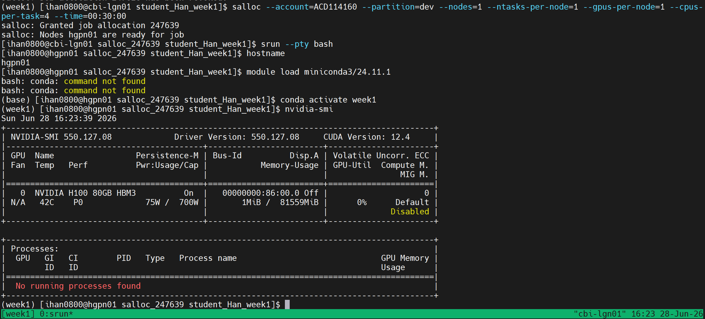
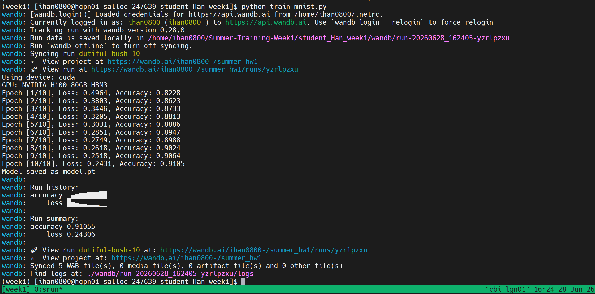
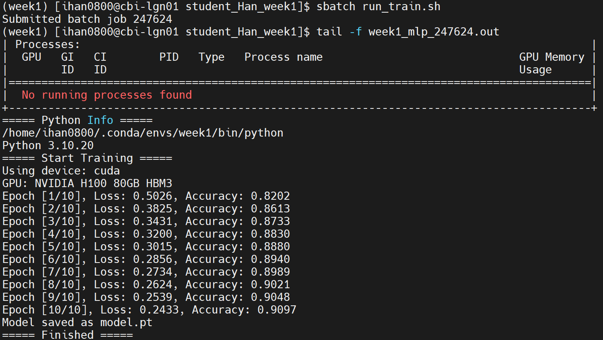

## TWCC截圖

### nvidia-smi

### tmux training

### wandb result

## Nano5平台截圖

### 使用 `salloc` 取得節點

此截圖顯示我使用 `salloc` 申請節點，並成功進入分配到的 GPU 節點進行測試

### 在 `salloc` 節點上測試訓練程式

此截圖顯示我在 `salloc` 取得的節點上執行 `python train_mnist.py，並完成模型訓練

### 使用 `sbatch` 派送任務並用 `tail` 監控訓練過程

此截圖顯示我使用 `sbatch run_train.sh` 將訓練任務送到 Slurm 排程系統執行，並使用 `tail -f` 即時監控輸出檔
