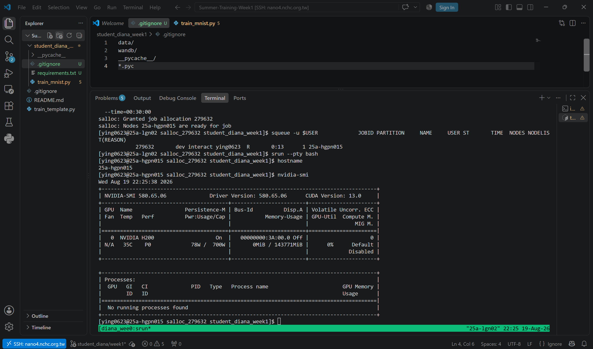
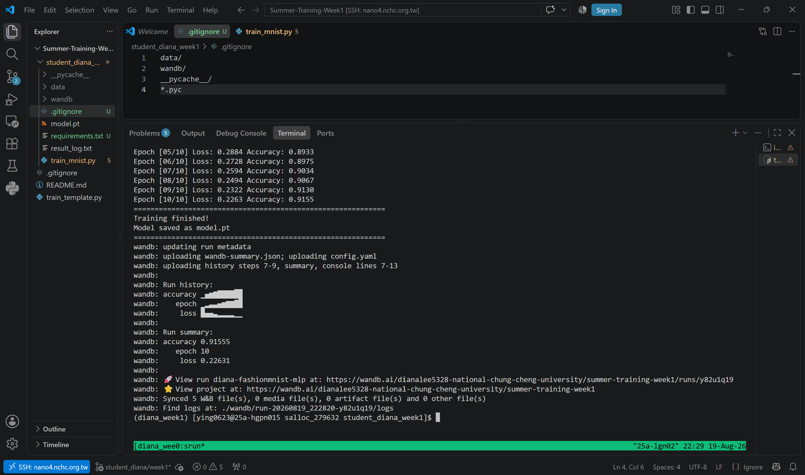
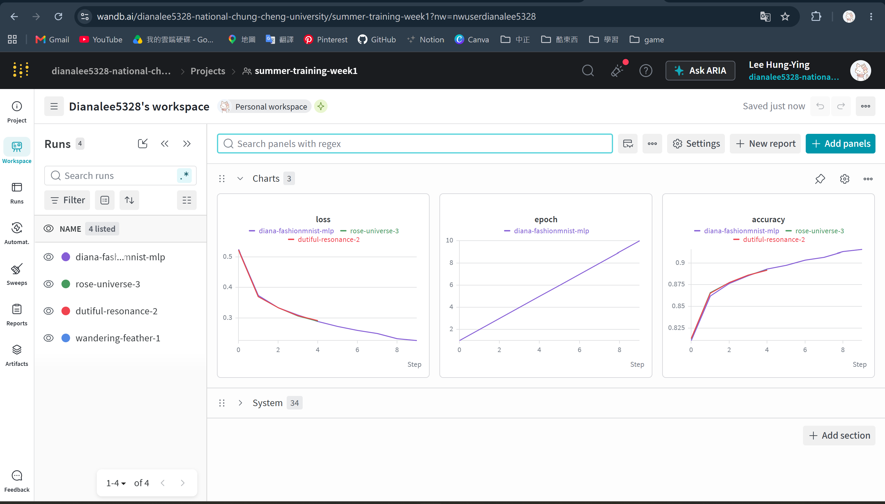

# Summer Training Week 1 - Diana

## Student Information

- Name: Diana
- Nano4 account: ying0623
- Project ID: ACD115140
- Dataset: FashionMNIST
- Model: MLP
- Framework: PyTorch
- Experiment Tracking: Weights & Biases

## Training Description

This assignment trains an MLP model on the FashionMNIST dataset using PyTorch.
The experiment was executed on a Nano4 GPU compute node and managed using tmux.
Training loss and accuracy were recorded using Weights & Biases.

## 1. NVIDIA GPU Information

The following screenshot shows the result of `nvidia-smi` on the Nano4 compute node.

## 2. Training with tmux

The following screenshot shows the model training process managed using tmux.

## 3. Weights & Biases

The following screenshot shows the training loss and accuracy curves on Weights & Biases.

