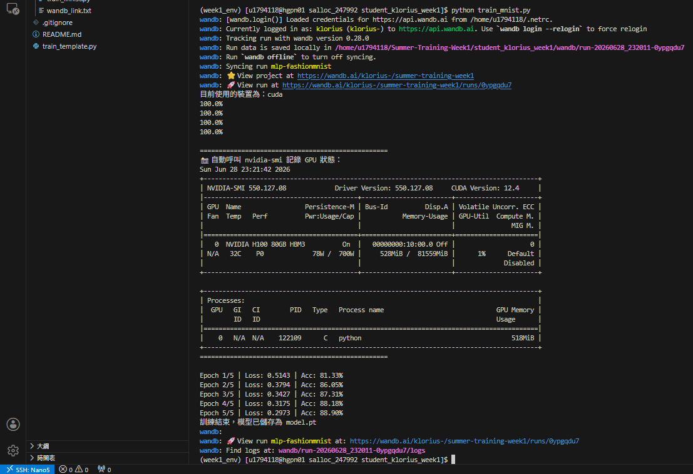
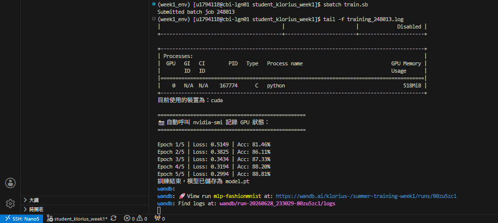

# HPC 開發環境測試作業

## 1. 互動式節點測試 (salloc)
使用 `salloc` 成功取得 GPU 運算節點 (hgpn01)，並執行 `train_mnist.py` 驗證環境無誤。

## 2. 任務派送與監控 (sbatch & tail)
將訓練任務透過 `sbatch` 派送至背景執行，並使用 `tail -f` 指令即時監控 Log 輸出，確認模型訓練流程正常且資源使用無誤。
