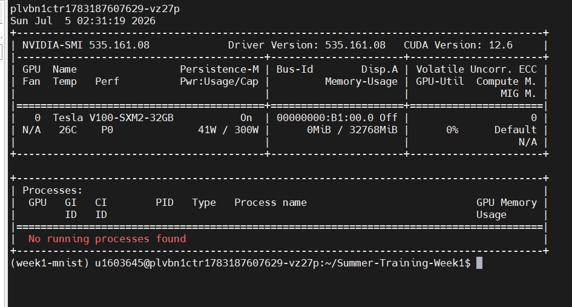
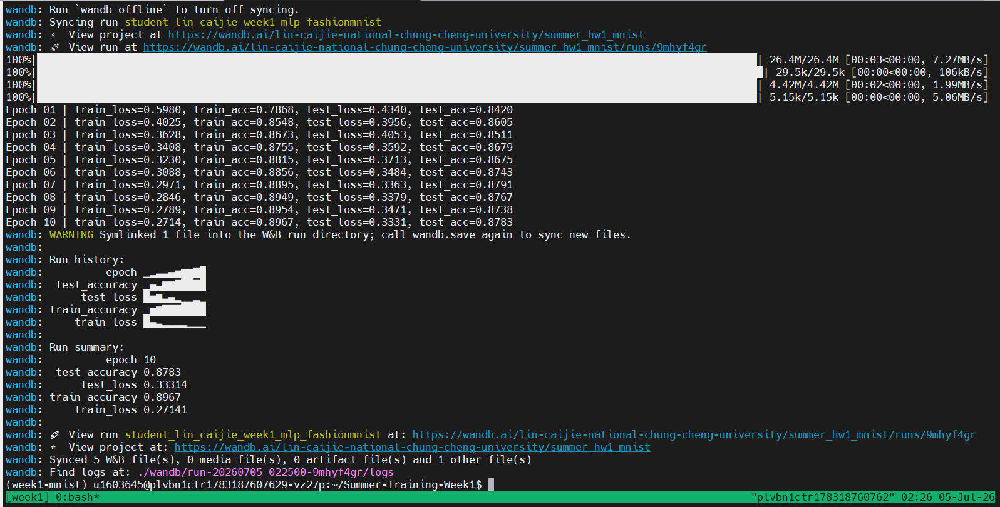
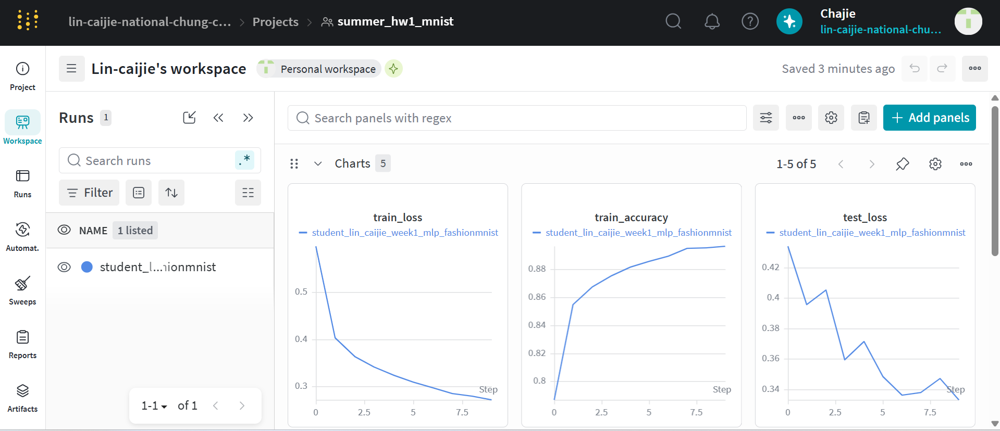
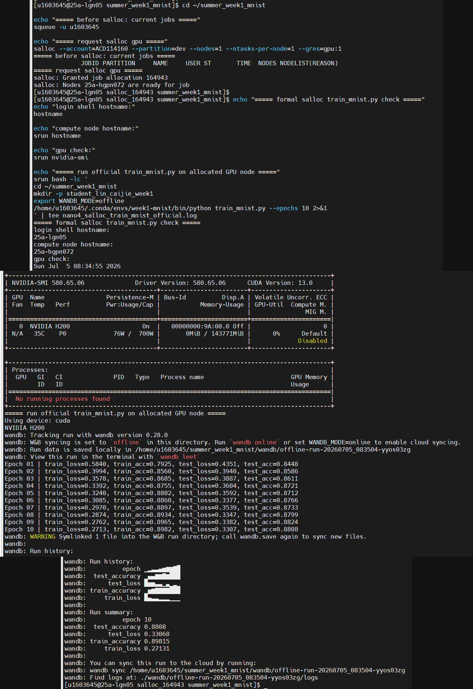
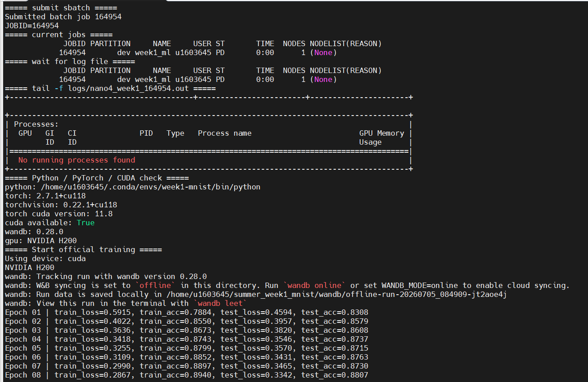

# Summer Training Week 1 — FashionMNIST MLP 訓練紀錄

## 一、作業內容

本次 Week 1 作業使用 PyTorch 實作簡單的 MLP 模型，資料集使用 FashionMNIST，並完成以下內容：

- 使用 PyTorch 建立 MLP 模型
- 讀取 FashionMNIST 訓練集與測試集
- 計算 training loss、training accuracy、test loss、test accuracy
- 使用 Weights & Biases 記錄訓練結果
- 將模型權重儲存為 `model.pt`
- 分別在 TWCC 與 Nano4 GPU 環境完成訓練與紀錄

主要程式檔案：

```text
train_mnist.py
```

---

## 二、檔案說明

```text
student_lin_caijie_week1/
├── README.md
├── train_mnist.py
├── requirements_TWCC_week1.txt
├── requirements_nano4_week1.txt
├── result_log_TWCC_week1.txt
├── result_log_nano4_week1.txt
└── images/
    ├── twcc-nvidia-smi.png
    ├── twcc-tmux-training.png
    ├── twcc-wandb-loss-accuracy.png
    ├── nano4-salloc-train-mnist-official.png
    └── nano4-sbatch-tail.png
```

檔案用途：

- `train_mnist.py`：FashionMNIST MLP 訓練主程式
- `requirements_TWCC_week1.txt`：TWCC 執行環境紀錄
- `requirements_nano4_week1.txt`：Nano4 執行環境紀錄
- `result_log_TWCC_week1.txt`：TWCC 訓練結果摘要
- `result_log_nano4_week1.txt`：Nano4 訓練結果摘要
- `images/`：TWCC 與 Nano4 執行截圖

---

## 三、模型與訓練設定

本次作業使用的模型為 MLP，架構包含：

- Flatten
- Linear
- ReLU
- Dropout
- Linear
- ReLU
- Linear output layer

訓練設定：

| 項目 | 設定 |
|---|---|
| Dataset | FashionMNIST |
| Model | MLP |
| Epochs | 10 |
| Batch size | 128 |
| Optimizer | Adam |
| Loss function | CrossEntropyLoss |
| Logging tool | Weights & Biases |

---

## 四、TWCC 執行結果

TWCC 使用 GPU 環境完成訓練，並以 tmux 保持訓練程序不中斷。

### 1. TWCC GPU 檢查

TWCC 環境成功偵測到 Tesla V100 GPU。



### 2. TWCC tmux 訓練畫面

訓練於 tmux session 中執行，FashionMNIST MLP 完成 10 epochs 訓練。



### 3. TWCC W&B 訓練紀錄

W&B 成功記錄 train loss、train accuracy、test loss、test accuracy 等指標。



TWCC 最終訓練摘要：

| 指標 | 數值 |
|---|---:|
| Epoch | 10 |
| Train loss | 0.2714 |
| Train accuracy | 0.8967 |
| Test loss | 0.3331 |
| Test accuracy | 0.8783 |

---

## 五、Nano4 執行結果

Nano4 使用 Slurm 執行，分別完成：

1. `salloc` 互動式 GPU allocation 測試
2. `sbatch` 批次任務提交
3. `tail -f` 即時監控 log

Nano4 使用的 GPU 為 NVIDIA H200，並確認 PyTorch 可使用 CUDA。

### 1. Nano4 salloc 訓練

`salloc` 成功取得 GPU node，並使用 `srun` 執行正式版 `train_mnist.py`。



Nano4 salloc 最終結果：

| 指標 | 數值 |
|---|---:|
| Allocation ID | 164943 |
| Compute node | 25a-hgpn072 |
| GPU | NVIDIA H200 |
| Epoch | 10 |
| Test accuracy | 0.8808 |

### 2. Nano4 sbatch + tail 監控

使用 `sbatch` 提交 Slurm batch job，並使用 `tail -f` 監控輸出 log。



Nano4 sbatch 最終結果：

| 指標 | 數值 |
|---|---:|
| Job ID | 164954 |
| GPU | NVIDIA H200 |
| CUDA available | True |
| Epoch | 10 |
| Test accuracy | 0.8869 |
| Status | Finished successfully |

---

## 六、環境紀錄

### TWCC

TWCC 環境與套件版本記錄於：

```text
requirements_TWCC_week1.txt
```

主要套件包含：

- torch
- torchvision
- torchaudio
- wandb
- matplotlib
- tqdm

### Nano4

Nano4 環境與執行設定記錄於：

```text
requirements_nano4_week1.txt
```

Nano4 使用的 Python 執行檔：

```text
/home/u1603645/.conda/envs/week1-mnist/bin/python
```

Slurm script 中使用絕對 Python 路徑，避免 batch job 執行時抓到錯誤環境。

Nano4 W&B 使用 offline mode：

```text
WANDB_MODE=offline
```

原因是 `sbatch` 為非互動式任務，使用 offline mode 可避免訓練過程等待 W&B 登入或 API key。訓練指標仍會記錄於本地 `wandb/` 目錄中。

---

## 七、總結

本次 Week 1 作業已完成 FashionMNIST MLP 訓練，並分別在 TWCC 與 Nano4 上完成 GPU 執行驗證。

TWCC 部分完成：

- GPU 環境檢查
- tmux 訓練
- W&B 線上紀錄

Nano4 部分完成：

- salloc GPU allocation
- sbatch batch job
- tail -f log 監控
- W&B offline logging
- `model.pt` 輸出驗證

最終測試準確率：

| 平台 | Test accuracy |
|---|---:|
| TWCC | 0.8783 |
| Nano4 salloc | 0.8808 |
| Nano4 sbatch | 0.8869 |
